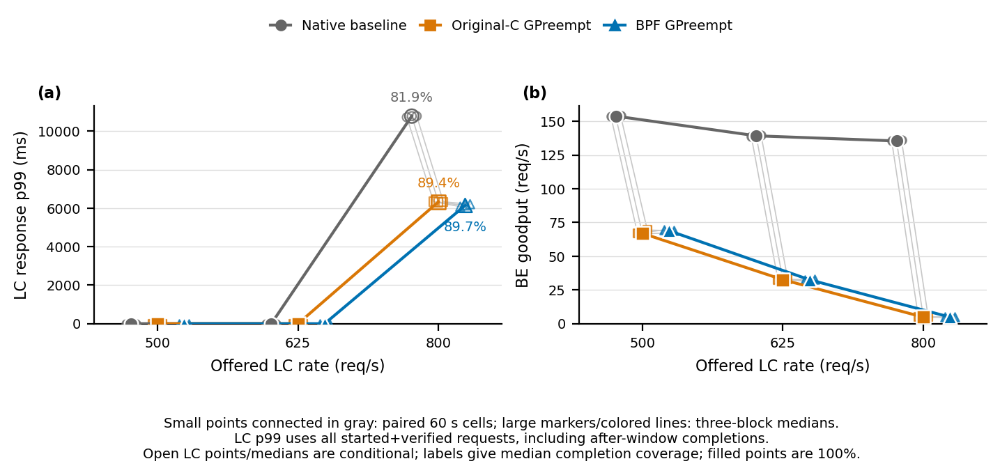

# GPreempt LC-knee sweep — completed 2026-09-03

## Result status

This is a valid, prespecified supporting experiment for RQ3. The independent
[audit](raw/lc-knee-full-575-01/independent-audit.json) accepts all 27 required
60-second cells (three rates × three arms × three paired blocks), with no
rejected, incomplete, or unexpected cells. The separate three-arm `lc800`
preflight passed and is not pooled into the estimates. Rates 500, 625, and 800
requests/s were fixed before execution; no post-hoc rate was added.



The [vector PDF](figures/lc-knee-full-575-01.pdf) plots every paired cell and
the three-block median. LC response is scheduled arrival to GPU-synchronized,
numerically verified output; BE goodput counts verified completions strictly
before the common cutoff. Open LC markers are conditional, and their labels
give median completion coverage.

## Exact results

Medians below are across the same three paired blocks. LC p99 is in
milliseconds, completion coverage is the fraction of offered LC requests that
started and were verified, and BE goodput is requests/s.

| Offered LC rate | Arm | LC response p99 (ms) | LC coverage | BE goodput (req/s) |
|---:|---|---:|---:|---:|
| 500 | Native | 1.757957 | 100.0% | 153.833 |
| 500 | Original-C GPreempt | 1.527230 | 100.0% | 66.967 |
| 500 | BPF GPreempt | 1.603860 | 100.0% | 68.883 |
| 625 | Native | 1.725128 | 100.0% | 139.250 |
| 625 | Original-C GPreempt | 1.601007 | 100.0% | 32.617 |
| 625 | BPF GPreempt | 1.603621 | 100.0% | 32.567 |
| 800 | Native | 10,777.526001 | 81.856% | 135.417 |
| 800 | Original-C GPreempt | 6,327.587644 | 89.352% | 4.867 |
| 800 | BPF GPreempt | 6,138.723629 | 89.669% | 4.867 |

Each entry below is the geometric mean of the three within-block ratios,
followed by its percentile 95% paired-block bootstrap interval (10,000 draws,
seed 20260903). Ratios are numerator/denominator: lower is better for LC p99;
higher is better for BE goodput. The `800` LC ratios compare conditional—not
all-offered—response populations.

| LC rate | Comparison | LC p99 ratio [95% CI] | BE goodput ratio [95% CI] |
|---:|---|---|---|
| 500 | Original / Native | 0.8719 [0.8586, 0.8887] | 0.4395 [0.4329, 0.4506] |
| 500 | BPF / Native | 0.9175 [0.8792, 0.9700] | 0.4457 [0.4385, 0.4517] |
| 500 | BPF / Original | 1.0523 [0.9894, 1.1297] | 1.0141 [0.9923, 1.0376] |
| 625 | Original / Native | 0.9512 [0.8732, 1.0591] | 0.2343 [0.2341, 0.2344] |
| 625 | BPF / Native | 0.8953 [0.8486, 0.9333] | 0.2314 [0.2260, 0.2345] |
| 625 | BPF / Original | 0.9413 [0.8555, 1.0031] | 0.9878 [0.9647, 1.0015] |
| 800 | Original / Native | 0.5877 [0.5848, 0.5913] | 0.03588 [0.03569, 0.03603] |
| 800 | BPF / Native | 0.5708 [0.5670, 0.5757] | 0.03592 [0.03579, 0.03606] |
| 800 | BPF / Original | 0.9711 [0.9589, 0.9806] | 1.0011 [0.9966, 1.0103] |

Independent recomputation from the 27 `per_cell_points`, rather than the
stored arm summaries, reproduced all nine medians, all 18 ratios, and all 18
interval endpoints.

## Interpretation

The sampled LC knee lies between 625 and 800 requests/s for all three arms:
coverage is complete at 625 and incomplete at 800. At 500, both GPreempt arms
reduce all-offered LC p99 relative to native, while retaining only about 44–45%
of native BE goodput. At 625, BPF retains a lower LC p99 than native but only
about 23% of native BE goodput; Original's LC interval crosses one. Thus the
foreground protection is purchased with a large and increasing background
throughput cost, not a simultaneous throughput or fairness improvement.

BPF follows Original-C closely. At 500 and 625, both BPF/Original intervals
include one for both metrics. At 800, BPF has 2.9% lower conditional LC p99
(ratio 0.971 [0.959, 0.981]), slightly higher median coverage (89.669% versus
89.352%), and indistinguishable BE goodput (1.001 [0.997, 1.010]). This supports
preservation of the original policy behavior over the measured sweep, but it
is not a formal equivalence result.

The overload point must remain conditional. Its LC p99 population is all
started and numerically verified requests, including after-window completions;
it excludes the never-started FIFO backlog. Across the three blocks, coverage
is 81.856–81.958% for native, 89.335–89.394% for Original, and
89.556–89.775% for BPF, leaving respectively 8,660–8,709, 5,091–5,119, and
4,908–5,013 offered requests never started. Therefore the 800-rate ratios do
not establish an all-offered tail-latency improvement. They do show that both
GPreempt arms start a larger offered prefix than native while producing lower
conditional p99, at the cost of reducing median BE goodput from 135.417 to
4.867 requests/s.

## Mechanism engagement and limits

- Every native cell records the intended VGG/ResNet stream priorities as
  −5/0. Policy engagement is inapplicable in exactly those nine cells.
- All 18 policy cells report positive decision activity. In every cell,
  hint/block/release/reset counts equal the number of foreground requests
  started; infer/preprocess counts equal all timed requests plus all 220
  warm-up/calibration requests. Original records 146,036,853–208,889,731 due
  decisions per cell and BPF records 113,853,763–173,211,298.
- Every recorded task has zero maximum numerical error under the frozen oracle,
  and every accepted cell has the planned 60-second window. Mechanism failure
  or a numerical error was not relabeled as performance.
- Both policy arms use the same host-mapped compatibility transport. The audit
  explicitly records `original_gdr_transport=false` and
  `equivalence_claimed=false`; this is not a GDRCopy reproduction or a claim
  about the original paper's hardware results.
- There are only three blocks on one RTX 5090/driver-575 configuration, two
  batch-one models, three sampled rates, and one-minute cells. The paired
  bootstrap quantifies block variation but is low-resolution and cannot prove
  equivalence or broad generality. Continuous BE supply has no invented
  offered-request denominator, and this sweep does not directly measure a
  resource-fairness objective.

## Five-part verdict

- **Run status — valid.** The formal independent audit is complete, the exact
  paired matrix is present, and correctness and engagement evidence pass.
- **Tested hypothesis — supported within the frozen scope.** BPF preserves
  Original-C's foreground-protection/background-progress behavior across the
  sampled rates; this does not mean equivalence or superiority.
- **Research value — supporting.** The run prospectively brackets the load
  knee and exposes the latency/goodput tradeoff; it is not a new decisive RQ.
- **Paper impact — additional RQ evidence and a workload boundary.** It
  strengthens the mechanism-preservation story while showing that overload
  protection can nearly starve BE work; it is not a direct thesis challenge.
- **Next paper decision — include with the boundary intact.** Use the figure as
  supporting knee evidence, report the BE cost and conditional 800-rate
  population, and make no all-offered, equivalence, fairness, GDRCopy, or
  post-hoc-rate claim. Any denser knee localization or fairness study must be a
  separate prospective experiment rather than an appended cell.

## Reproduction

The completed audit can be replotted without GPU access:

```bash
python3 workloads/gpreempt/plot_lc_knee.py \
  workloads/gpreempt/raw/lc-knee-full-575-01/independent-audit.json \
  --output-prefix workloads/gpreempt/figures/lc-knee-full-575-01
```

The plotting contract is covered by `python3 -m unittest -v
test_plot_lc_knee.py` from `workloads/gpreempt/`. The plotter refuses to
overwrite an existing prefix.
