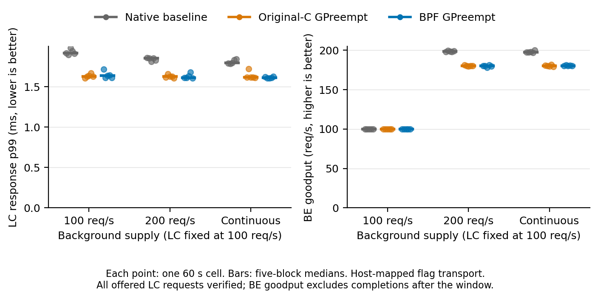

# GPreempt contention study — completed 2026-09-03

**45/45 real-GPU cells passed independent audit:** three load scenarios,
five randomized paired blocks, native baseline / original-C / actual BPF.
The BPF port reproduces the original policy's foreground/background tradeoff
on this compatibility setup. It is not uniformly faster or statistically
proven equivalent to C.

## Results

All values below are medians of five 60-second cells. LC is foreground VGG19
at 100 requests/s; BE is background ResNet152. Lower LC response p99 is better;
higher BE goodput is better.

| BE supply | Metric | Native baseline | Original C | BPF |
| --- | --- | ---: | ---: | ---: |
| 100 req/s | LC response p99, ms | 1.916555 | 1.628926 | 1.636552 |
| 100 req/s | BE goodput, req/s | 100.000 | 100.000 | 100.000 |
| 200 req/s | LC response p99, ms | 1.853529 | 1.624812 | 1.610963 |
| 200 req/s | BE goodput, req/s | 198.517 | 179.983 | 179.967 |
| Continuous | LC response p99, ms | 1.795937 | 1.614817 | 1.610008 |
| Continuous | BE goodput, req/s | 197.717 | 179.967 | 180.100 |



[Standalone PDF](figures/load-study-575-20260903.pdf),
[XSched/GPreempt four-panel PDF](figures/scheduling-comparison-2x2.pdf),
[four-panel caption and measurement boundaries](figures/scheduling-comparison-2x2.caption.md).
Points are individual cells and bars are medians, not confidence intervals.
XSched's queue-entry latency in seconds and GPreempt's response latency in
milliseconds are different metrics and must not be directly compared.

### Paired effects

Each entry is `100 × (paired geometric-mean ratio − 1)`, followed by its 95%
paired-block bootstrap interval, in percent. We resample five whole blocks
10,000 times with seed 20260903. These estimates are not ratios of the medians
above. Negative LC change is beneficial; negative BE change is a cost.

| BE supply | Comparison | LC response p99 change | BE goodput change |
| --- | --- | ---: | ---: |
| 100 req/s | C / native | −15.31% [−16.42, −14.27] | 0.00% [0.00, 0.00] |
| 100 req/s | BPF / native | −14.82% [−16.52, −12.50] | 0.00% [0.00, 0.00] |
| 100 req/s | BPF / C | +0.57% [−1.28, +3.73] | 0.00% [0.00, 0.00] |
| 200 req/s | C / native | −11.68% [−12.62, −10.61] | −9.31% [−9.69, −8.86] |
| 200 req/s | BPF / native | −11.61% [−13.12, −10.12] | −9.47% [−9.93, −8.94] |
| 200 req/s | BPF / C | +0.09% [−1.64, +1.95] | −0.18% [−0.68, +0.32] |
| Continuous | C / native | −9.61% [−11.91, −6.46] | −8.95% [−9.70, −8.25] |
| Continuous | BPF / native | −10.81% [−11.70, −9.91] | −8.88% [−9.46, −8.33] |
| Continuous | BPF / C | −1.32% [−4.19, +0.51] | +0.08% [−0.36, +0.51] |

Both policy implementations protect foreground response at the expense of
background progress under heavy supply. BPF/C intervals contain zero change;
five blocks do not establish formal equivalence or a universal sub-1% overhead.
At BE 100 req/s every arm meets the offered rate: equal goodput there says
nothing about maximum capacity. Continuous BE removes that rate cap but does
not, by itself, establish 100% GPU utilization.

## What was implemented and measured

- Native uses one primary CUDA context and prioritized streams, with actual
  LC/BE priorities −5/0. C and BPF use the same two-context GPreempt executor.
- The BPF arm executes reset/hint/block/release decisions through
  [host ubpf JIT](../../extension/gpreempt_hint.bpf.c) and role-timeslice policy
  through [kernel BPF callbacks](../../extension/gpreempt_policy.bpf.c). CUDA launches, flag
  writes and synchronization remain executor operations. The C arm follows
  the original decisions without BPF execution.
- Both policy arms use **host-mapped flags**, not original GDRCopy. They retain
  the blocking kernels, 100 µs early hint and LC/BE timeslice requests of
  1,000,000/1 µs. Accepted requests/callbacks do not prove a 1 µs hardware
  preemption quantum. All arms use the same custom 575 driver; the baseline
  is native CUDA on that driver, not a stock-driver comparison.
- This uses seeded FP32 TVM testing models, batch one, CUDA graphs and 200 µs
  preprocessing. All 1,000 output elements are checked against isolated CUDA
  references; these are not pretrained-model accuracy measurements or the
  authors' original model binaries/hardware reproduction.
- New common-phase FIFO arrivals use a shared monotonic 60-second window.
  LC response runs from scheduled arrival to synchronized, numerically
  verified output, including FIFO wait but excluding network/server overhead.
  BE goodput counts only verified completions strictly inside the window.

The [old config-A study](results-575-host-mapped-20260903.md) remains unchanged.
Its approximately 1.4 ms values measured six service stages, not this response
boundary. The new study also fixes arrival phase and CUDA-context/error
handling. Do not attribute the difference from the old study solely to load,
or subtract their latency values as if they were the same metric.

## Completeness and overload accounting

The [final independent audit](raw/load-study-full-575-20260903/independent-audit-final.json)
accepts all 45 cells with no rejected, missing or unexpected attempts. All
270,000 offered LC requests were verified **inside** their measurement windows:
100% completion coverage, no foreground backlog or conditional foreground p99.

BE 100 req/s also has no backlog. At BE 200 req/s, the per-cell never-started
backlog is explicitly retained (blocks 0–4):

| Arm | Never-started requests, out of 12,000 offered per cell |
| --- | --- |
| Native | 114, 6, 88, 110, 65 |
| Original C | 1127, 1200, 1203, 1201, 1200 |
| BPF | 1201, 1182, 1306, 1130, 1207 |

Each BE 200 and continuous cell has one already-started completion after the
window, excluded from goodput. No started request remains unfinished after
cleanup. Periodic accounting includes in-window completions, that late
completion and never-started backlog; no arrival is silently dropped.
BE 200 response p99 is conditional on started/completed requests, so it is not
an all-offered p99 claim. Continuous BE has no periodic offered/backlog
denominator. Full request timestamps and auxiliary service metrics remain raw.

Every cell passed full-output numerical checks, expected policy-action counts,
CUDA error checks, GPU telemetry and cleanup. Each BPF cell has real-JIT and
both-context kernel-control evidence. Across all cells, 695,302 timed requests
were verified (695,272 inside the windows); including 110 warmup/calibration
requests per role per cell, 705,202 requests / 705,202,000 output values passed,
with maximum absolute error zero. C and BPF each recorded 90,000 of every
reset/hint/block/release action; BPF controlled and cleaned up all 30 contexts.
The 15,255 telemetry samples peaked at 54°C. Eighteen samples in seven cells
reported the fixed 400 W power cap; there was no thermal or other abnormal
throttling. These power-limited samples remain included.

Final state: GPU idle, no compute clients,
UVM reference count zero, no struct-ops maps/links, no new Xid; power limit
400 W. GDM and nvidia-persistenced stayed active. No driver, service or runtime
change occurred during the study.

## Artifact and replay

The [frozen plan](load-study-plan.md) was followed without retries or workload
changes. The three 10-second [preflight cells](raw/load-study-preflight-575-20260903)
are excluded. Full execution ran 04:53:52–05:50:03 UTC on 2026-09-03, RTX 5090,
Linux 6.15.11-061511-generic and NVIDIA 575.57.08. Runtime/runner source was
frozen at gpu_ext commit `d6a4e4c`, upstream GPreempt `249ee3e`, with the already
loaded scheduling port recorded as `849ea75d`. Subsequent commits add analysis,
plots and documentation, not changes to the timed implementation.

[Raw directory](raw/load-study-full-575-20260903) contains the execution plan,
explicit build/model file inventories and sizes, all request reports, commands,
policy logs, telemetry, progress, independent audit and final host snapshot.
The separate `build/load-study` leaves old `build/ninja` binaries untouched.

From the repository root, on the prepared idle host, use a **new** output path:

```bash
sudo -n /usr/bin/python3 -B workloads/gpreempt/run_load_study.py full \
  --output workloads/gpreempt/raw/load-study-replay-01 \
  --cell-timeout 240 --cooldown-seconds 5
```

Offline reanalysis needs no GPU; the following only prints results:

```bash
python3 -B workloads/gpreempt/analyze_load_study.py \
  workloads/gpreempt/raw/load-study-full-575-20260903
```

Figures are reproducible with `plot_load_study.py` and
`plot_scheduling_comparison.py`, passing the final audit and a fresh
`--output-prefix`. Post-run CPU validation passed the C++ FIFO/window test,
14 runner tests, 19 independent-audit tests, four standalone-plot tests, eight
four-panel tests and 18 legacy three-way regression tests.
Independent read-only result review passed: medians, paired intervals,
request conservation and the claim/compatibility boundaries above were checked
against the final raw audit. Both figures were visually inspected.
